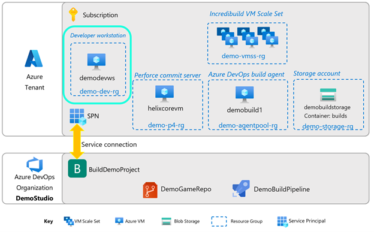
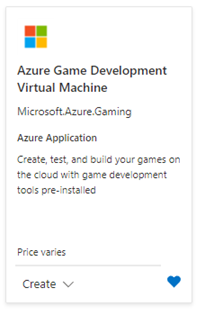
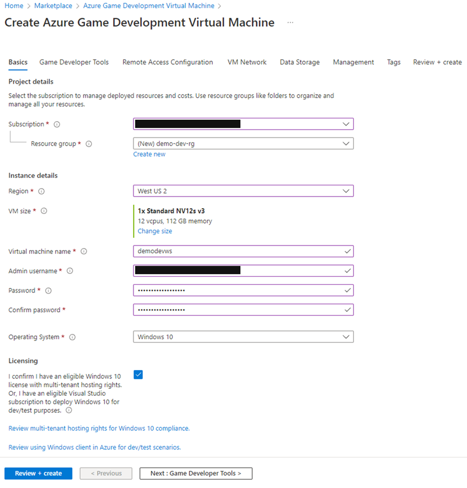
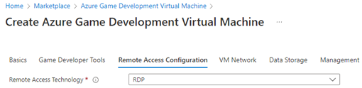

# Section 1: Developer Workstation

## Setting up the developer workstation

For the demo, this workstation can be a physical machine or a VM, but in either case it needs discrete graphics capability.  In this guide, we will use the Azure Game Development Virtual Machine. You can find it in the Azure Marketplace as a public preview offering:

Find the Azure Game Development VM offering in the Azure Marketplace and create a VM.

1. Fill in your **Subscription**, **Resource Group**, and **Region**.
2. The Game Developer VM currently ships on N-series VMs, so please ensure you have enough quota on these SKUs. For information on checking and requesting quota, please see [this page](/azure/azure-portal/supportability/per-vm-quota-requests).  
3. Select your **VM size**. For the demo, you can use the default VM choice.
4. Fill in the **VM name**, **admin name**, and **password**. For operating system, either Windows 10 or Windows Server 2019 works well, and the choice depends more on what you have a license for.
5. Go to the next step: **Game Developer Tools**.

6.	Next, choose the **Game Engine** to be installed. Select Unreal Engine 4.27.2. You can leave all other choices as the default.

7. Next, choose RDP as the **Remote Access Technology**.

8.	At this point, you can click on **“Review + create”** for purposes of this demo.
9.	Click **Create** once the review is done with no errors.

## Using your own developer workstation

If you do not wish to use the Azure Game Development VM, please make sure you have the following software on your workstation:

- Unreal Engine 4 (version 4.27 to match the version of the demo game, ShooterGame)
- [Perforce Visual Client (P4V)](https://www.perforce.com/downloads/helix-visual-client-p4v)
- [Perforce Helix Admin Tool (P4Admin)](https://www.perforce.com/downloads/administration-tool)
- [Azure Storage Explorer](https://azure.microsoft.com/features/storage-explorer/)

## Next steps

Next, go to Section 2: [Version Control](./azurecloudbuilds-2-versioncontrol.md).

Or go back to the [Introduction](./azurecloudbuilds-0-intro.md).

Troubleshooting page is [here](./azurecloudbuilds-9-troubleshooting.md).
