# Section 2: Version Control

[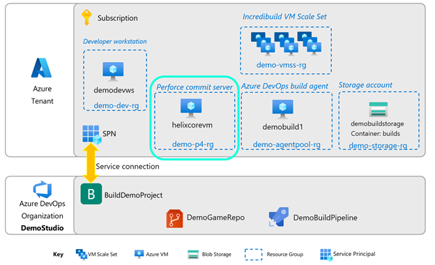](media/cloud-build-pipeline/acb-2-versioncontrol/acb-2-roadmap.png)

## Installing the Perforce Helix Core server

In this section, we’ll walk through set up of a Perforce Helix Core server. You can install Perforce Helix Core directly onto an existing Azure VM the same way you would a physical machine. In this guide, we will use the conveniently pre-packaged Azure Marketplace offering called the Perforce Enhanced Studio Pack, pictured below.

[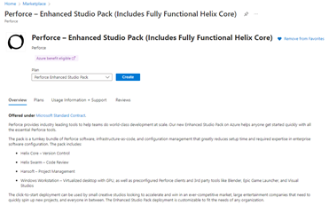](media/cloud-build-pipeline/acb-2-versioncontrol/p4espoffer.png)

This offering lets you define where inside your Azure Subscription a Perforce Helix Core will be created, on what type of VM and Operating System, and if you would like additional Perforce components such as Helix Swarm and Hansoft installed as well.

In this pipeline example, we use this Perforce Enhanced Studio Pack and set up a linux-based Helix Core main server.

1. In the Azure Marketplace, search for “Perforce Enhanced Studio Pack”. 
2. Click on Create to begin the process.
3. Please continue setup with Perforce's have a comprehensive setup and verification [documentation]().
4. Once done return here to resume. For the purposes of this pipeline, only the Helix Core server needs to be set up; Helix Swarm, Hansoft and Virtual workstation are optional.

Some notes:
- this offering will install a user named ‘perforce’. This is the administrative user of the depot. As described in Perforce’s documentation, the password for this user is the Helix Core Instance ID.
- also described in their documentation, the administrative user of the Perforce commit VM is a separate user named “centos”. Login is via the SSH key that you would have generated or provided at creation time.

 :pencil: *Save this info!*  
-	Helix core Instance ID
-	P4 commit public IP address

Once the Helix Core commit server is up and running, the next step is to set up the depot, and check in the demo game source code. We’ll use the developer workstation to do this.

## Code depot setup
1.	Log into the developer workstation.
2.	Create a folder C:\p4depots. We will use this as our Workspace root later.
3.	Open the Helix Core Admin tool (p4admin).
4.	Upon first login, you will be asked by Perforce to trust the fingerprint of the server. Take note of this fingerprint, you will need it later.
5.	Create two Standard users, one developer and one build user. For this demo, we will use the names dev_user and build_user respectively. Your Users & Groups tab should appear similar to this:

[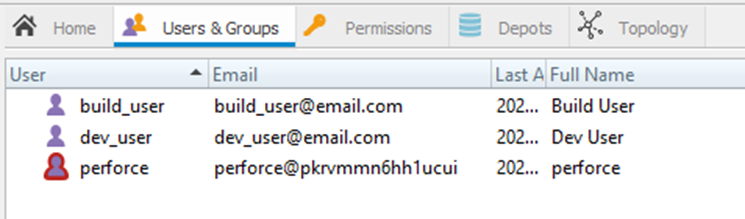](media/cloud-build-pipeline/acb-2-versioncontrol/p4usersgroups.png)

:pencil: *Save this info!*  
-	Build user name
-	Build user password
-	Fingerprint

6. Now open the Perforce Visual Client (p4v). We will set up the workspace for the developer user with this. 
7. Log in to p4v as the developer user. Leave the Workspace blank for now.
8. Here is a suggested configuration of the dev user’s workspace. (We will set up the build user’s workspace later.)
- Workspace name: “demodevws-ws”
- Workspace root: “C:\p4depots”
9. Create a new workspace.
 
10.	Name your workspace and select the C:\p4depots folder as your Workspace root. Accept all default depot tree mappings. Your workspace set up should look similar to the one below.

[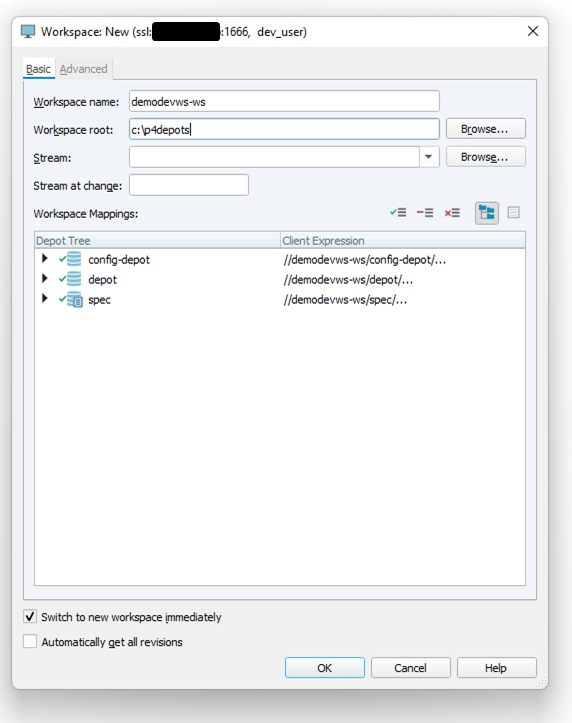](media/cloud-build-pipeline/acb-2-versioncontrol/p4workspace.png)

11. Click OK. 

12. In Workspace tab, right-click c:\p4depots and click Get Latest Revision.
13. You should see the config-depot and spec depots show up. But the main depot will likely be missing because there are no files in it. This is a unique situation for a first-time Perforce depot setup, and we will fix this manually:
- Create the folder c:\p4depots\depot
- In p4v, click Refresh. All your depots should now be set up.

[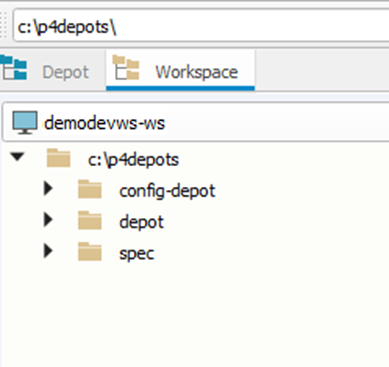](media/cloud-build-pipeline/acb-2-versioncontrol/p4depots.png)

## Install demo source code. 
14.	Launch the Epic Games launcher. In the left menu, select Unreal Engine. Then select the Learn tab. Scroll down to the Learning Games section, and find the Shooter Game tile. Click on the tile to start installing Shooter Game.

[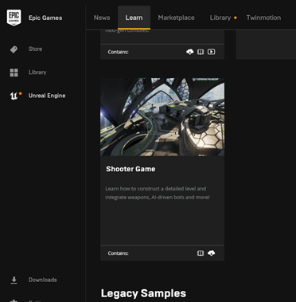](media/cloud-build-pipeline/acb-2-versioncontrol/epiclauncher.png)

15. In Choose Project Name and Location, choose the p4 depot. Following the ongoing example, install to c:\p4depots\depot\ShooterGame

[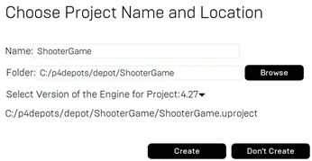](media/cloud-build-pipeline/acb-2-versioncontrol/epicgameinstall.png)

16.	Add a file called .p4ignore (no extension) in the ShooterGame folder, at the same place you find ShooterGame.uproject.  You can get the contents from [this GitHub location](https://github.com/mattmarcin/ue4-perforce/blob/master/.p4ignore)
- This file will ensure that the depot will not contain data that doesn’t need to get checked in, e.g. Intermediate files. This saves sync time and disk space for artifacts that will get compiled anyway.
- If you use this file (as opposed to using your own), please edit it to ensure you have replaced the text “GAMEPROJECT” at the bottom of the file with “ShooterGame”. 

[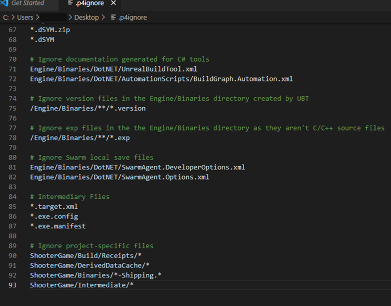](media/cloud-build-pipeline/acb-2-versioncontrol/p4ignorefile.png)

17.	In p4v, click Refresh. You should now see all the ShooterGame files in your workspace.

[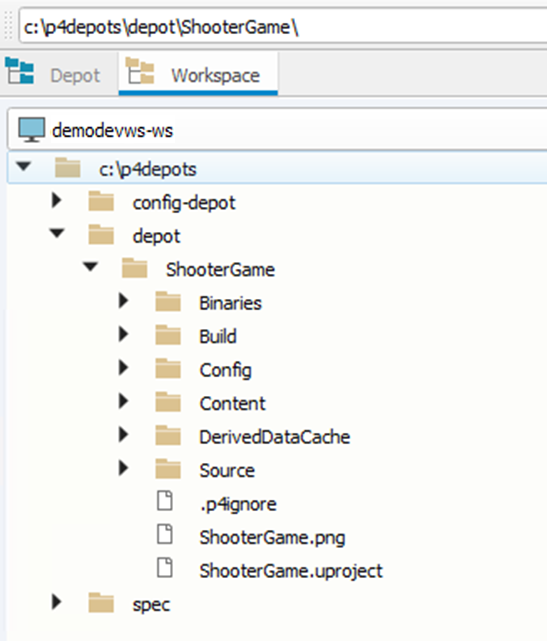](media/cloud-build-pipeline/acb-2-versioncontrol/ShooterGame1.png)

18.	Right-click ShooterGame and click Mark for Add…

[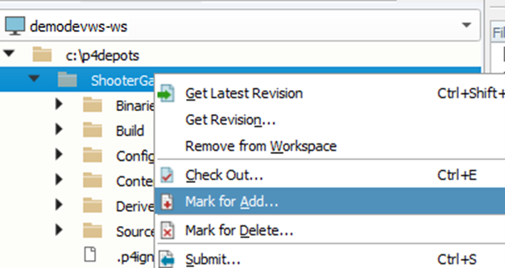](media/cloud-build-pipeline/acb-2-versioncontrol/ShooterGame2.png)

19. Right-click ShooterGame again and click Submit… write a changelist description, like “initial check in”. Click Submit.

18.	After all files are sync’ed to the depot, your depot layout should look something like this, with all ShooterGame files under source control:

[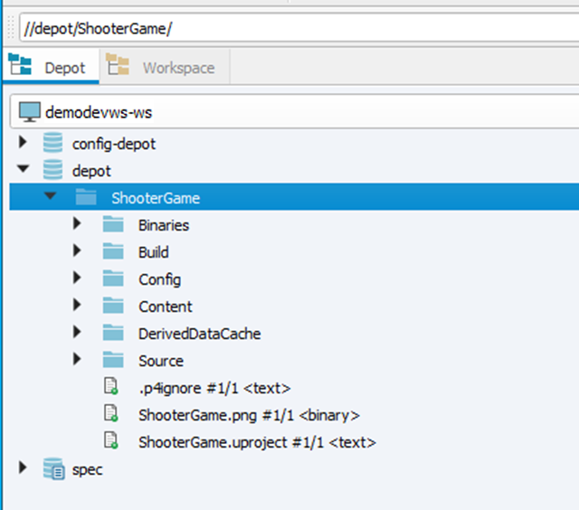](media/cloud-build-pipeline/acb-2-versioncontrol/ShooterGame3.png)

19. Now launch the Unreal Editor by clicking the ShooterGame.uproject. Verify the game sample works. You may have to associate .uproject files with Unreal Editor to do so.

[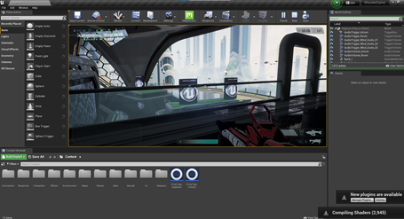](media/cloud-build-pipeline/acb-2-versioncontrol/ShooterGame4.png)

## Install Azure Storage Explorer

We will use this tool to download the build created by the build pipeline. In a browser on the developer workstation, install [Azure Storage Explorer](https://azure.microsoft.com/features/storage-explorer/).

## Next steps
Next, go to Section 3: [Azure DevOps Organization and Project](./azurecloudbuilds-3-azdo.md).
Or go back to the [Introduction](./azurecloudbuilds-0-intro.md).
Troubleshooting page is [here](./azurecloudbuilds-9-troubleshooting.md).