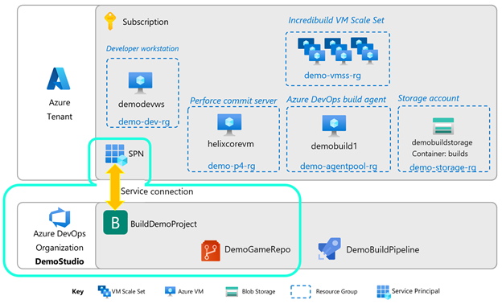
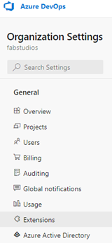
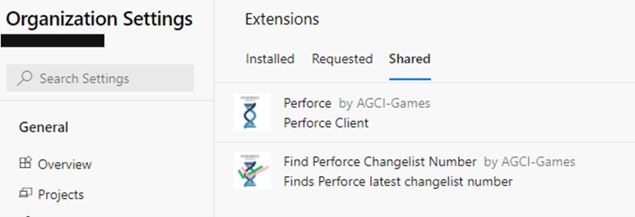
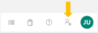
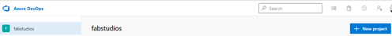
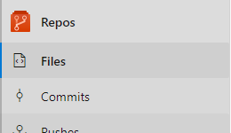
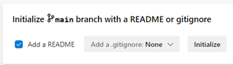

# Section 3: Azure DevOps Organization and Project

In this section, we will do initial set up of Azure DevOps. We will use an Azure DevOps Perforce extension that will handle code sync from the Perforce depot. At the time of this guide's publication, this extension was in Private Preview.

Please contact us at azuregameproduction@microsoft.com to be included in a Private Preview of this extension. 

Also, if you do not already have an Azure DevOps Organization, navigate to the [Azure DevOps home page](https://dev.azure.com/) to start a free account.

## Install Perforce Extensions

There are two extensions in the Azure DevOps Marketplace to be installed. You will require Project Collection Administrator permissions to do so, otherwise please get the help of your Azure DevOps administrator.
The Azure DevOps Perforce extensions are in Private Preview now, so they won’t be visible in the Azure DevOps marketplace. Instead, please contact <email> and request to be added. You will need to provide your Azure DevOps Organization name, e.g. dev.azure.com/MyStudioName.

1. Navigate to https://dev.azure.com/<your Organization name>

2. In the bottom left corner, click on Organization settings.

3. In the left settings menu, under General, click on Extensions.

4. Click on Extensions / Shared. If you have received confirmation that the extensions have been shared with you, you will see them here:

(Note: these are preview extensions; functionality, documentation and artwork may vary at time of publication of this guide.)

5.	Click on each of these extensions and install them in your Azure DevOps instance.

6.	They should now show up under Installed Extensions.

## Create a personal access token (PAT)

A Personal Access Token will be needed later for the Perforce trigger to call the Azure DevOps pipeline and manage build agents and agent pools.  Set one up as follows:

7.	In Azure DevOps look for the Personal Settings icon (pictured below) in the top-right corner of the web page. Left click on it, then click on “Personal Access Tokens”. 

8. Create a new token by clicking on + New Token. Fill in all the data for the PAT, name it, choose (and note!) your expiry date carefully. For Scopes for this demo, you will want:
- Agent Pools – Read & manage
- Build – Read & execute
You may have to click on “Show all scopes” to uncover them all. As good security practice, you’ll want to keep the expiry time as soon as is practicable, with the fewest Scopes needed to fulfill the task. 

 :pencil: *Save this info!* 
 Once the PAT token is generated, note it down securely – after navigating away from the page, you will no longer be able to see it, and we’ll need it in two places during the setup, later.

## Create a Project

9.	Within your Organization, create a new project by clicking + New project in the top right of the web page.

10. Name the project and determine visibility (who can see this project within your organization) as you wish.  Advanced options: for this demo, you can leave the advanced options as they are.

11. In the project, create a new Repo by clicking on Files under the Repos icon, pictured here. 

12. It will say the project is empty, and to add some code. In the bottom-most option (Initialize a main branch with a README or gitignore), click Initialize. Although our game code is in perforce, we will use this Repo to store and version our pipeline code. 

## Create service connections for your project

For your Azure DevOps pipelines to access Azure resources like Virtual Machine Scale Sets and Storage Accounts, you will need a service principal-based linkage between the two. This project-level linkage is in the form of a service connection. Specifically, one that is an Azure Resource Manager type. Please follow the instructions starting here to set this up.

13. You will first need to create a service principal in your Azure subscription. Follow [these instructions](https://docs.microsoft.com/azure/active-directory/develop/howto-create-service-principal-portal). 

14. Next, create an Azure Resource Manager [service connection](https://docs.microsoft.com/en-us/azure/devops/pipelines/library/connect-to-azure?view=azure-devops#create-an-azure-resource-manager-service-connection-with-an-existing-service-principal). Use the existing service principal created from the step before.

For Azure Resource Manager service connection setup, try the automatic method first, and if there is a problem with finding your subscription, try the manual method next.

For manual setup, have on hand your:
- Subscription ID
- Subscription Name
- Application (Client) ID (this will map to the Service Principal ID field)
- Service Principal Key (the actual value, not the Secret ID)
- Directory (Tenant) ID

Check the box “Grant access permissions to all pipelines”.

:pencil: ***Save this info!*** :pencil:
- Service connection name

## Next steps

Next, go to Section 4: [The Build Agent](./azurecloudbuilds-4-buildagent.md).

Or return to the [Introduction](./azurecloudbuilds-0-intro.md).

Troubleshooting page is [here](./azurecloudbuilds-9-troubleshooting.md).
