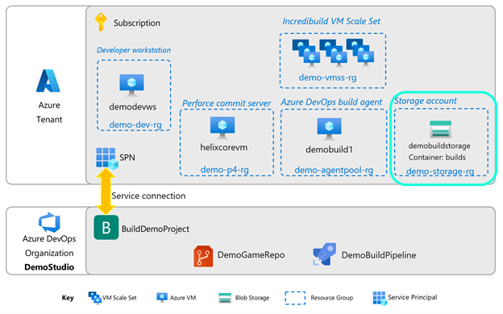
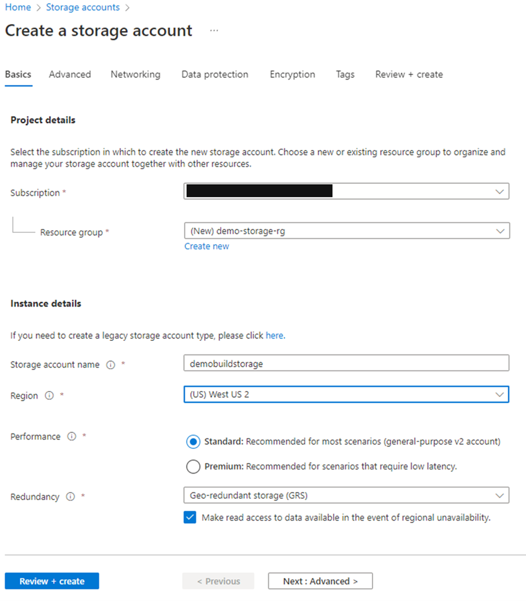
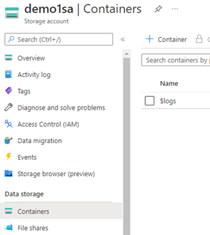

# Section 5: Simple build distribution

We will use an Azure Blob Storage container to hold all our builds. Let’s set that up now.

1.In your Azure subscription, create a Storage account

2. Enter your **Subscription**, **resource group**, **storage account name**, and **region**.

3. For **Performance and Redundancy**, you can leave the default choices.

4. At this point, you can click on **Review + create**, then **Create**, for the purposes of this demo. Feel free, however, to customize networking, security and other settings.

5. Once the storage account is provisioned, go to the resource. 

6. Now, create a container within the new storage account. In the left settings menu, click on **Containers**, then **+Container**.

7. In the New container blade:
    - Name: Enter the name of your new container
    - Public access level: select Container (anonymous read access for containers and blobs)

> [!NOTE
>
> This access level is for demo purposes only. Please do not store sensitive information in this container, alternatively secure your setup with information from [here](/azure/architecture/framework/services/storage/storage-accounts/security).

8. Click **Create.**

:pencil: ***Save this info!*** :pencil:

-	Storage account name
-	Container name

## Next steps

Next, go to Section 6: [Azure DevOps Pipeline](./azurecloudbuilds-6-azdopipeline.md).

Or return to the [Introduction](./azurecloudbuilds-0-intro.md).

Troubleshooting page is [here](./azurecloudbuilds-9-troubleshooting.md).
