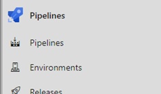
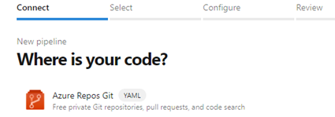
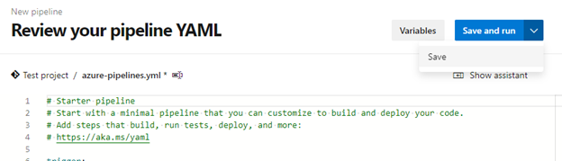
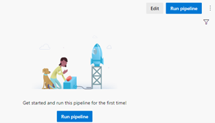
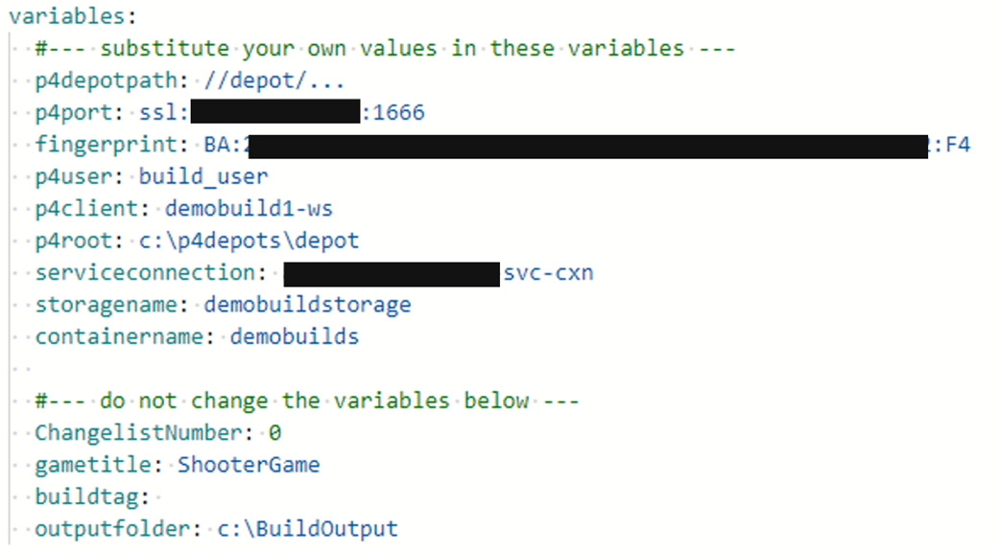
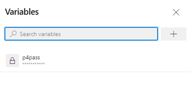
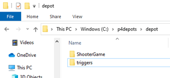
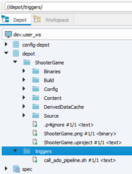
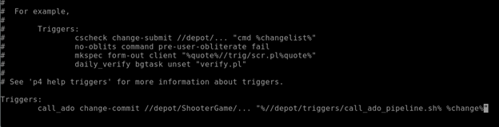

# Section 6: The Azure DevOps Pipeline

[](media/cloud-build-pipeline/acb6-azdopipeline/acb6-roadmap.png)

Now we have all the pieces to finally create the pipeline in Azure DevOps. We can do this from a browser on any workstation.
- Create the pipeline
- Set the pipeline variables
- Set up Perforce tasks
- Archive files
- Copy files to Storage blob

## Create the pipeline

1.	In a browser, navigate to https://dev.azure.com/<*{your Organization name}*

2.	Go to your Azure DevOps project. In the left menu blade, click **Pipelines**, under Pipelines:

[](media/cloud-build-pipeline/acb6-azdopipeline/pipelinemenu.png)

3.	On the Create your first Pipeline page, click **Create pipeline**.

4.	For where is your code? Choose **Azure Repos Git** and pick the Repo you just created in the previous step.

[](media/cloud-build-pipeline/acb6-azdopipeline/pipelinesetup1.png)


5.	 Select **Existing Azure Pipelines YAML file**. Pick the **Starter pipeline**.

6.	You will advance to the **Review your pipeline YAML** page.

[](media/cloud-build-pipeline/acb6-azdopipeline/pipelinesetup2.png)

7.	We will overwrite almost all the boilerplate code in the following steps. But for now, click the down chevron next to **Save and run**, click **Save**. enter a commit message, and click **Save** again.

8.	Once the pipeline save is complete, click **Edit**.

[](media/cloud-build-pipeline/acb6-azdopipeline/pipelinesetup3.png)


9.	Now let’s modify the existing pipeline. Delete all the boilerplate YAML script and insert the following:

```yaml

trigger: none

pool: 
  name: Default

variables:
  #--- insert your own values in these variables ---
  p4depotpath: <insert your own values>
  p4port: <insert your own values>
  fingerprint: <insert your own values>
  p4user: <insert your own values>
  p4client: <insert your own values>
  p4root: <insert your own values>
  serviceconnection: <insert your own values>
  storagename: <insert your own values>
  containername: <insert your own values>
  
  #--- do not change the values below ---
  ChangelistNumber: 0
  gametitle: ShooterGame
  buildtag: 
  outputfolder: c:\BuildOutput

- task: Perforce@1
  displayName: Sync Perforce to CL
  inputs:
    UseDepotPath: true
    DepotPath: '$(p4depotpath)'
    P4ROOT: '$(p4root)'
    CreateWorkspace: false
    Sync: true
    Clean: false
    Force: false
    synctype: 'changelist'
    CHANGELIST: '$(CHANGESET)'
    P4CLIENT: '$(p4client)'
    P4PORT: '$(p4port)'
    ssl: true
    fingerprint: '$(fingerprint)'
    P4USER: '$(p4user)'
    P4PASSWD: '$(p4pass)'
    
- task: PowerShell@2
     displayName: Build the game
  inputs:
    targetType: 'inline'
    script: |

      Write-Host "Building game"
      cd "C:\Epic Games\UE_4.27\Engine\Build\BatchFiles"
      .\RunUAT.bat BuildCookRun -project="$(p4root)\$(gametitle)\$(gametitle).uproject" -noP4 -platform=Win64 -clientconfig=Development -serverconfig=Development -cook -allmaps -build -stage -pak -archive -archivedirectory="$(outputfolder)"
     
      Write-Host "Setting build tag"
      $d = Get-Date
      $tag = '$(gametitle)' + "-" + $d.year.tostring() + $d.month.tostring() + $d.day.tostring() + $d.hour.tostring() + $d.minute.tostring() + $d.second.tostring() + "-CL" + $(ChangelistNumber)
      Write-Output ("##vso[task.setvariable variable=buildtag]$tag")

- task: ArchiveFiles@2
  inputs:
    rootFolderOrFile: '$(outputfolder)\WindowsNoEditor'
    includeRootFolder: false
    archiveType: '7z'
    sevenZipCompression: 'fastest'
    archiveFile: '$(Build.ArtifactStagingDirectory)/$(buildtag).$(Build.BuildId).zip'
    replaceExistingArchive: true
    verbose: true

- task: AzureFileCopy@4
     displayName: Copy build to storage account
  inputs:
    SourcePath: '$(Build.ArtifactStagingDirectory)/$(buildtag).$(Build.BuildId).zip'
    azureSubscription: '$(serviceconnection)'
    Destination: 'AzureBlob'
    storage: '$(storagename)'
    ContainerName: '$(containername)'
```
### Populate the variables with your values

- **p4depotpath**: the depot path of the build user, e.g. //depot/...
- **p4port**: the connection string of your perforce server, e.g. ssl:*{ip address}*:1666
- **fingerprint**: the SSL fingerprint of your perforce server, e.g. BA:xx:xx:xx:xx:xx:xx:xx:xx:xx:xx:xx:xx:xx:xx:xx:xx:xx:xx:F4
- **p4user**: the name of your p4 build user, e.g. build_user
- **p4client**: the client workspace name of your build user, e.g. demobuild1-ws
- **p4root**: the perforce root on your build machine, e.g. c:\p4depots\depot
- **serviceconnection**: the name of the service connection you created in step LINK
- **storagename**: the name of the Azure Storage Account you created in step LINK
- **containername**: the name of the Container you created in step LINK

Once you have filled in your values for each variable, your script should look something like this:

[](media/cloud-build-pipeline/acb6-azdopipeline/pipelinesetup4.png)


## Set a secret pipeline variable

There’s one variable, the Perforce user password, that we want to keep hidden. To do this:

1. Click **Variables** in the upper-right of the screen

[](media/cloud-build-pipeline/acb6-azdopipeline/variables1.png)

2.	Click **New variable**

3.	Insert the following data

- Name: p4pass
- Value: *{your p4 build user password}*
- Keep this value secret: check this box

4.	Click **Save**. Your variables blade should look something like the following.

[](media/cloud-build-pipeline/acb6-azdopipeline/variables2.png)


## Pipeline explanation

These are the main sections to the pipeline, explained in brief.

- *Trigger*. This tells the pipeline not to trigger on changes to the Azure DevOps repo, because we are going to install our own trigger later.
- *Pool*. This requests a build agent from the Default agent pool. There is only one build agent in there, the one you set up in Section 4.
- *Variables*. This section defines all the variables the pipeline will consume downstream.
- *Task: Perforce*. This is the extension you installed earlier. It syncs the depot on the build machine to the changelist number defined in variable CHANGESET. This variable will be passed in directly from the Perforce trigger, which we will set up shortly. 
- *Task: Powershell script*.
    - Executes an inline powershell script that calls the Unreal Automation Tool to build the game at a specific location in the depot
    - Stores the resulting build to the output folder
    - Renames the file with a build tag comprised of date/time and ChangelistNumber
- *Task: Archive File*. Zips up the loose files in the build output into a single compressed file.
- *Task: Azure File Copy*. Copies the file into an Azure Blob store for downstream use.


## Install the Helix Core commit server trigger

We are ready to link Perforce with the Azure DevOps pipeline with a Perforce trigger.
This trigger goes into action whenever a change happens on a specified branch in the depot. In our example, we want the trigger to fire whenever there is a change committed to the //depot/ShooterGame branch. The trigger will call a shell script (*call_ado_pipeline.sh*) that will send a REST call to Azure DevOps to activate a pipeline. 

1.	First, find out the number of the Azure DevOps pipeline you just created. The easiest way is to go to Pipelines, then click your pipeline. The browser URL bar will display something like 

```
https://dev.azure.com/gamestudio/ShooterGameBuildPipeline/_build?definitionId=1
```

The number after definitionId is your pipeline’s serial number; note it for the next step. In the case above, the pipeline's number is 1.


2.	On your dev workstation, with your favorite code editor, create a text file “call_ado_pipeline.sh” with the following content:

```sh
#!/bin/sh

curl -u <PAT token> -X POST https://dev.azure.com/<your ADOName>/<yourProjectName>/_apis/pipelines/<pipelineNumber>/runs?api-version=6.0-preview.1 -H "Content-Type: application/json" -d '{"variables":{"CHANGESET":{"isSecret":false,"value":"'$1'"}}}'
```

Note the variable CHANGESET in the JSON block; that is the variable you used in the Azure DevOps pipeline to tell the extension what changelist number to sync to.

3. Create a folder under the depot called triggers and save the file there.

[](media/cloud-build-pipeline/acb6-azdopipeline/p4triggers1.png)

4.	Open p4v and refresh your workspace. You should see the triggers folder appear in the workspace. Right-click on it and **Mark for add…**   then right-click again and **Submit…**

5.	Your depot should now contain the trigger as follows:

[](media/cloud-build-pipeline/acb6-azdopipeline/p4triggers2.png)

6.	SSH login to your Helix Core commit server as the administrative user, centos.  You can use something like PuTTY, or an Azure Bastion host. Either way, make sure you have your SSL key handy.

7.	Become the perforce user with 

```
su – perforce
(enter your password, which is the Helix Core Instance ID)
```

8.	Edit the p4 triggers file.

```
p4triggers
``` 

9.	The default editor, vi, starts up with the triggers file. 
- Go to the bottom of the file:   Shift-G
- Type ‘o’ to enter insert mode on a new line.
- Indent: tab 
- Copy this text and place it in the file:

```sh
call_ado change-commit //depot/ShooterGame/... “%//depot/triggers/call_ado_pipeline.sh% %change%”
```

Your file should now look similar to this: 

[](media/cloud-build-pipeline/acb6-azdopipeline/p4triggers3.png)

10.	Save and exit with: '\<esc\> Shift-ZZ' (that is twice with  Z)

> [!WARNING]
> The trigger you have created contains the Personal Access Token in the clear. For purposes of illustration, this guide does not specifically secure the trigger branch. 
> However, for security, we highly recommend you set permissions such that only highly-privileged users can see it.


For more info on perforce triggers, please see the following links.

[Creating Perforce triggers](https://www.perforce.com/manuals/p4sag/Content/P4SAG/scripting.trigger.creating.html)

[Scripting and storing Perforce triggers](https://www.perforce.com/manuals/p4sag/Content/P4SAG/scripting.triggers.basics.html#Storing)


## Next steps

Next, go to Section 7: [Testing](./azurecloudbuilds-7-testing.md).

Or return to the [Introduction](./azurecloudbuilds-0-intro.md).

Troubleshooting page is [here](./azurecloudbuilds-9-troubleshooting.md).