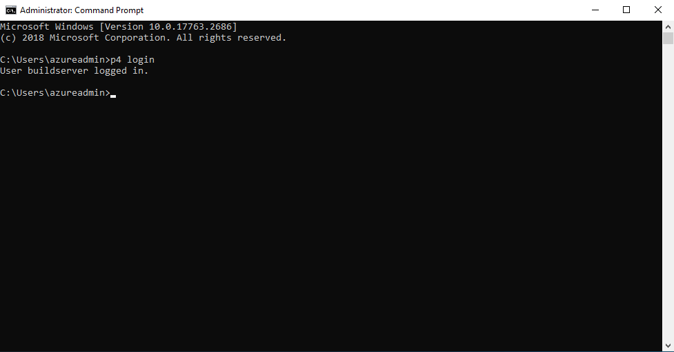

# Using Azure Active Directory Managed Identities to connect to Perforce Helix Core

## Overview

To use Azure Active Directory as an Identity Provider for Helix Core, Perforce has developed two pieces of software that need to be installed and configured:

1. Helix Authentication Service (HAS)
2. Helix Authentication Extension

The Service acts as a Token Service in the Authentication flow, the Extension configures Helix Core to make use of that Token Service for Authentication.
Using Managed Identities support a non-interactive log-on flow, which can be great in scenarios like build servers, or in situations where you don’t want to ask the user to log in, but just use the machine’s identity.

## Prerequisites

To configure Helix Core to use Azure Active Directory (AAD) as its Identity Provider, a Helix Core commit server needs to be available. For this guide we have installed Helix Core through Perforce’s Enhanced Studio Pack in the Azure Marketplace. It contains Helix Core, Swarm, Hansoft and a Windows workstation, with 5 licenses to go with that.
Log on to the Helix Core Virtual Machine

1. SSH into the Virtual Machine
2. Move to the perforce user

```bash
sudo su – perforce
```

3. Allow the p4 client to create a logged-on context to the database

```bash
p4login -v 1
```

## Install Helix Authentication Service

The official documentation for installing Helix Authentication Service (HAS) from Perforce can be found here. In order to group the whole flow in a single document, below are the main commands needed to install HAS.

In this walkthrough we install HAS on the same machine as Helix Core. HAS can also be installed on a dedicated machine, so not to utilize resources from the commit server.

Normally we’d be able to install HAS through YUM, however at the time of writing this walkthrough the functionality of using Managed Identities to log on to Perforce has not been packaged. To work around this, we install HAS through Perforce’s official GitHub repository.

1. SSH into the Virtual Machine
2. Move to the perforce user

```bash
sudo su – perforce
```

3. Download and install the service

```bash
cd /tmp
wget https://github.com/perforce/helix-authentication-service/archive/refs/heads/master.zip
unzip master.zip
sudo mv helix-authentication-service-master /opt/perforce/helix-auth-svc
```

4. Install the service

```bash
cd /opt/perforce/helix-auth-svc
./install.sh
```

After this command HAS is installed and running. In order to be able to access the endpoint the Network Security Group needs to be opened:

1. In the **Azure portal**, go to the **Resource Group** where the ESP is installed
2. Select the **Network Security Group**
3. Click on **Inbound security rules** on the left
4. Click **+ Add** on the top of the blade
5. Fill out the input fields:
    1. Source: IP Addresses
    2. Source IP addresses/CIDR ranges: the IP address (range) you are connecting from
    3. Source Port ranges: *
    4. Destination: Any
    5. Service: Custom
    6. Destination port ranges: 3000
    7. Protocol: Any
    8. Action: Allow
    9. Name: HAS

## Install Helix Authentication Extension

The extension cannot be installed through YUM at this time. It can be downloaded from the official Perforce Github repository. This walkthrough downloads the latest version from Github, as it contains some new bits around the use of Managed Identities that have not been added to the release yet, at the time of writing. It is also possible to download a QA tested release from Perforce’s Github, but that does not support the Managed Identity flow at the time of writing.

1. SSH into the Virtual Machine
2. Move to the perforce user

```bash
sudo su – perforce
```

3. Download and extract the extension

```bash
cd /tmp
wget https://github.com/perforce/helix-authentication-extension/archive/refs/heads/master.zip
unzip master.zip
```

4. Package and install the extension

```bash
cd helix-authentication-extension-master/
p4 extension --package loginhook
p4 extension --install loginhook.p4-extension --allow-unsigned -y
```

## Configure the machine that needs to log on using the Managed Identity

When using Managed Identities in combination with Perforce, a User Assigned Managed Identity works best. This is because when we configure Perforce to map the AAD user to a Perforce user, with a User Assigned Managed Identity we can utilize a single Identity to map to a single Perforce user.

### Create a User Assigned Managed Identity

The first step is to create the User Assigned Managed Identity. Follow the steps below:

1. Sign in to the **Azure Portal**
2. Click **+ Create a resource**
3. In the **search box**, type **managed identity**
4. In the search results, select **User Assigned Managed Identity**
5. Click **Create**
6. Fill out the form, choosing the correct **Region** and selecting a descriptive **Name**
7. Click **Review + Create**

### Configure the Virtual Machine to use the Managed Identity

The following steps configure the Virtual Machine to use the User Assigned Managed Identity:

1. Sign in to the **Azure Portal**
2. Navigate to the **Virtual Machine**
3. Click **Identity** in the menu on the left
4. Choose **User assigned**
5. Hit **+ Add**
6. Choose the **Identity** that you created in the previous step
7. Click **+ Add**

The Virtual Machine can now use the Managed Identity to interact with AAD.

### Setup the client-side scripts

This particular P4 login type executes a piece of script on the client VM. The script talks to the Instance Metadata Endpoint, and fetches a JWT token, and gives that back to the script. The script can be anywhere on the filesystem (even as part of a P4 depot) and the location is configured in P4. Follow these steps to configure the client-side scripts on the VM:

1. RDP into the VM
2. Create a folder, for instance C:\P4SSOSCRIPTS
3. Create a new file in that folder, called get-token.cmd with the following contents:

```dos
@echo off & setlocal
set batchPath=%~dp0
powershell.exe -file "%batchPath%get-token.ps1" %*
```

4. Create another file in that folder, called get-token.ps1 with the following contents:

```powershell
$resource=$args
$metadata = Invoke-WebRequest "http://169.254.169.254/metadata/identity/oauth2/token?api-version=2018-02-01&resource=$resource” -Headers @{"Metadata"="true"}
$json = $metadata.Content | ConvertFrom-Json
Write-Host $json.access_token 
```

5. Configure Perforce to use the files:

```dos
p4 set P4USER=buildserver
p4 set P4PORT=ssl:<<PUBLIC IP ADDRESS>>:1666
p4 set P4LOGINSSO="c:\temp\get-token.cmd %ssoArgs%"
```

6. Trust the new connection to this Perforce instance:


```dos
p4 trust -y
```

## Configuring HAS and AAD

### Configure AAD

The Managed Identity flow is essentially a JWT flow. In the following steps we’ll configure an App Registration in AAD with an App Role that allows the Managed Identity to fetch a token to use Perforce. Follow these steps:

1. Sign in to the **Azure Portal**
2. Go to your **Active Directory**
3. Choose **App Registrations** from the menu on the left
4. Click **+ New registration**
5. Click **Register**

Optionally, we can give the App registration an Application ID URI. This makes interacting with the App registration for tokens etcetera easier, as we can identify the App registration through the URI, instead of a GUID:

1. Go to the **Azure portal**
2. Go to **Azure Active Directory**
3. Select **App Registrations** from the menu on the left
4. Go to the **App Registration** you made earlier
5. On the **Overview** page, click **Add** an **Application ID URI**
6. On the next page, hit **Set**, and type a meaningful URI, like api://perforcebacked

The next step is to create an App Role:

1. In the **App Registration** you just created, click **App Roles** from the menu on the left
2. Click **+ Create app role**
3. Fill out the form, for instance:
    1. Display Name: Call Perforce
    2. Allowed Member Types: Applications
    3. Value: Perforce.Call
    4. Description: App Role to allow Managed Identity to fetch a token to call Perforce
4. Click **Apply**

The last step is to grant the Managed Identity permissions to use the App Role. This cannot be done through the portal, so execute a piece of Powershell script instead. To finish this step you’ll need the following parameters ready:

7. The AAD Tenant ID:
    1. Go to the **Azure portal**
    2. Go to **Azure Active Directory**
    3. On the **Overview** blade, copy the **Tenant ID**
8. The App Registration Client ID
    1. Go to the **Azure portal**
    2. Go to **Azure Active Directory**
    3. Select **App Registrations** from the menu on the left
    4. Go to the **App Registration** you made earlier
    5. On the **Overview** blade, copy the **Application (client) ID**
9. The Value of the App Role Permission
    1. Go to the **Azure portal**
    2. Go to **Azure Active Directory**
    3. Select **App Registrations** from the menu on the left
    4. Go to the **App Registration** you made earlier
    5. Click on **App roles** from the menu on the left
    6. Copy the **Value** from the **App Role** that is listed
10. The Display name of the User Assigned Managed Identity
    1. This is the **Name** of the **User Assigned Managed Identity** you created earlier

Replace the placeholders with their actual values, and run the following script:
```powershell
Install-Module AzureAD
$TenantID = <<AAD TENANT ID>>
$GraphAppId = <<AAD APP REGISTRATION CLIENT ID>>
$DisplayNameOfMSI = <<MANAGED IDENTITY NAME>>
$PermissionName = <<APP ROLE PERMISSION VALUE>>
Connect-AzureAD -TenantId $TenantID
$MSI = (Get-AzureADServicePrincipal -Filter "displayName eq '$DisplayNameOfMSI'")
Start-Sleep -Seconds 10
$GraphServicePrincipal = Get-AzureADServicePrincipal -Filter "appId eq '$GraphAppId'"
$AppRole = $GraphServicePrincipal.AppRoles | Where-Object {$_.Value -eq $PermissionName -and $_.AllowedMemberTypes -contains "Application"}
New-AzureAdServiceAppRoleAssignment -ObjectId $MSI.ObjectId -PrincipalId $MSI.ObjectId -ResourceId $GraphServicePrincipal.ObjectId -Id $AppRole.Id
```

### Configure the Helix Authentication Extension

To complete this step, you’ll need the public IP address from the machine where HAS has been installed.

1. SSH into the Virtual Machine
2. Move to the perforce user

```bash
sudo su – perforce
```

3. Configure the extension

```bash
p4 extension --configure Auth::loginhook
```

4. Change the following:
    1. ExtP4USER: perforce
    2. Auth-Protocol: saml
    3. Service-URL: https://&lt;&lt;PUBLIC IP ADDRESS&gt;&gt;:3000
5. Exit vi and save the configuration

```bash
:wq <ENTER>
```

6. Configure the extension instance

```bash
p4 extension --configure Auth::loginhook --name loginhook-a1
```

7. Change the following:
    1. enable-logging: true
    2. client-name-identifier: oid
    3. client-sso-users: buildserver
    4. client-user-identifier: FullName
    5. non-sso-users: perforce

8. Exit vi and save the configuration

```bash
:wq <ENTER>
```

Lastly, we configure the Extension to send the Application ID URI to the client. This will keep the client-script generic, and the server determines the AAD Application to fetch the token for:

1. SSH into the Virtual Machine
2. Move to the perforce user

```bash
sudo su – perforce
```

3. Set the P4 SSO Args:

```bash
p4 configure set auth.sso.args='<<AAD APP ID URI>>'
```

### Configure Helix Authentication Service

To configure HAS, you’ll need 3 pieces of information:

1. The **IP address** of the Virtual Machine that hosts HAS
2. The oAuth Audience:
    1. Go to the **Azure portal**
    2. Go to **Azure Active Directory**
    3. Click **App registrations** on the left
    4. Select the **App registration** you created earlier
    5. On the **Overview** page, copy the **Application ID URI**
3. The AAD Tenant ID:
    1. Go to the **Azure portal**
    2. Go to **Azure Active Directory**
    3. Click **App registrations** on the left
    4. Select the **App registration** you created earlier
    5. On the **Overview** page, copy the **Directory (tenant) ID**

Now we can go to the Virtual Machine and configure HAS:

1. SSH into the Virtual Machine
2. Move to the perforce user

```bash
sudo su – perforce
```

3. Create a new configuration file:

```bash
cd /opt/perforce/helix-auth-svc/
sudo mv .env .envold
sudo vi .env
```

4. Contents (replace the 3 entries with your own values):

```ini
DEFAULT_PROTOCOL=saml
SVC_BASE_URI=https://<<PUBLIC IP ADDRESS>>:3000
LOGGING=/opt/perforce/helix-auth-svc/logging.config.cjs
CLIENT_CERT_CN=LoginExtension
OAUTH_JWKS_URI=https://login.microsoftonline.com/common/discovery/v2.0/keys
OAUTH_AUDIENCE=<<AAD APP REGISTRATION AUDIENCE>>
OAUTH_ISSUER=https://sts.windows.net/<<AAD TENANT ID>>/
```

5. Exit

```bash
:wq <ENTER>
```

After this step everything is configured, and we should restart both the Extension and HAS:

1. SSH into the Virtual Machine
2. Move to the perforce user

```bash
sudo su – perforce
```

3. restart HAS and the Extension

```bash
sudo systemctl restart helix-auth
p4 admin restart
```

## Setting up the Perforce User

When the Enhanced Studio Pack is just installed, there is only one user, and there are no groups. For this walkthrough we’ll create a user called buildserver, where the Perforce Full Name is equal to the Object ID of the User Assigned Managed Identity we created earlier. This way the Extension can map the AAD user to the Perforce User.

To get the Object ID of the User Assigned Managed Identity follow these steps:

1. Go to the **Azure portal**
2. Go to **Azure Active Directory**
3. Select **Enterprise applications** from the menu on the left
4. On the line of filter options, by default the **Application type** is set to **Enterprise Applications**, change this to **Managed Identities**
5. You’ll see a list with **Managed Identities**, copy the **Object ID** from the **Managed Identity** you created earlier.

To create the user do the following:

1. SSH into the Virtual Machine
2. Move to the perforce user

```bash
sudo su – perforce
```

3. Create a user named buildserver

```bash
p4 user -f buildserver
```
4. Change the following fields:
    1. FullName: &lt;&lt;AAD OBJECT ID OF USER ASSIGNED MANAGED IDENTITY&gt;&gt;
5. Exit vi and save the configuration

```bash
:wq <ENTER>
```

6. Set up Perforce to allow for SSO Authentication to be used:


```bash
p4 configure set auth.sso.allow.passwd=1
```

7. Giving the newly created user a random password in Perforce, as they will be using AAD to log in:

```bash
yes $(uuidgen) | p4 -u perforce passwd buildserver
```

## Test the setup

Testing the setup can be done through multiple ways. Examples include the Windows Workstation that can be deployed as part of the Enhanced Studio Pack, or the use of the Azure Game Dev VM. In the end we’ll need a machine with the Perforce Client tools installed, either P4V or the CLI tools. It can be an on-premises machine or a cloud-based machine.

In this walkthrough we’ll RDP into an instance of the Azure Game Dev VM, as it has all the tools installed.

To test the setup, you’ll need the IP address of the Helix Core instance. If the machine is in the same Virtual Network, this can be a Private IP address. If it is not in the same Virtual Network, it needs to be the public IP address. Regardless, make sure this machine is listed in the Network Security Group to be able to access Helix Core.

1. RDP into the Virtual Machine
2. Open up a Windows Terminal, and type:

```bash
p4 login
```

3. You should see a prompt telling you you have logged in:
[](media/cloud-build-pipeline/perforce-mi-login-success.png)

## Troubleshooting

Most issues can be resolved by using the log files from both the Extension and HAS. They can be found at these locations:
Extension:

- /p4/1/depots/p4-extensions/117E9283-732B-45A6-9993-AE64C354F1C5/1-data/log.json

HAS:

- /opt/perforce/helix-auth-svc/auth-svc.log

The documentation on the Perforce Github page has an extensive amount of troubleshooting tips.
